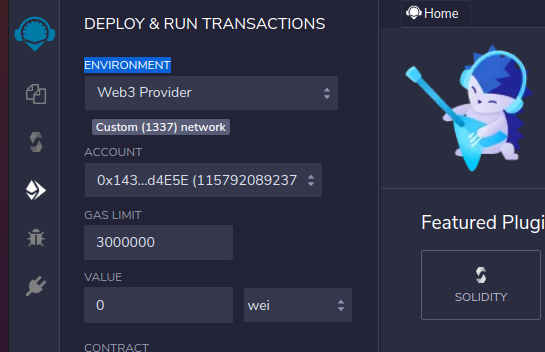
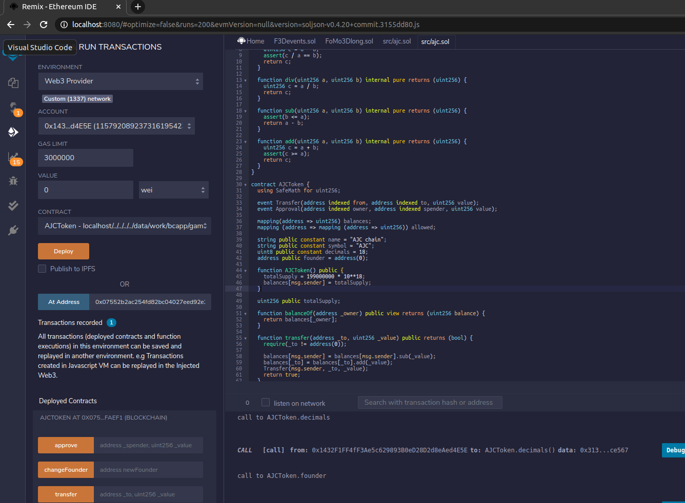

使用geth搭建本地的开发节点


参考: https://www.npmjs.com/package/remix-ide

```
docker pull remixproject/remix-ide:latest
docker run -p 8080:80 remixproject/remix-ide:latest
```

```
cnpm install -g remixd
remixd -s /data/work/fomo3d_truffle  --remix-ide http://localhost:8080
```


用浏览器打开 http://localhost:8080, 设置ENVIROMENT, 选择web3 provider即本地节点



在remix的home页面选择connection to localhost 链接上一步启动的remixd , 以便remix可以直接防卫本地文件

```
geth --datadir /data/gethdata/  --ipcpath /data/gethdata/geth.ipc --rpc --rpccorsdomain="http://localhost:8080" --rpcapi web3,eth,debug,personal,net --vmdebug    --rpcport "8545" --rpcaddr "0.0.0.0"    --nodiscover  --dev
```


打开solidity源码文件, 进行编译, 连接到刚刚部署的本地节点




关于truffle的`RangeError: Maximum call stack size exceeded`
https://github.com/trufflesuite/truffle/issues/1671


部署成功的合约: 0xB5aB20A0Dc623bf41DC1889d9ba715CE698F880D